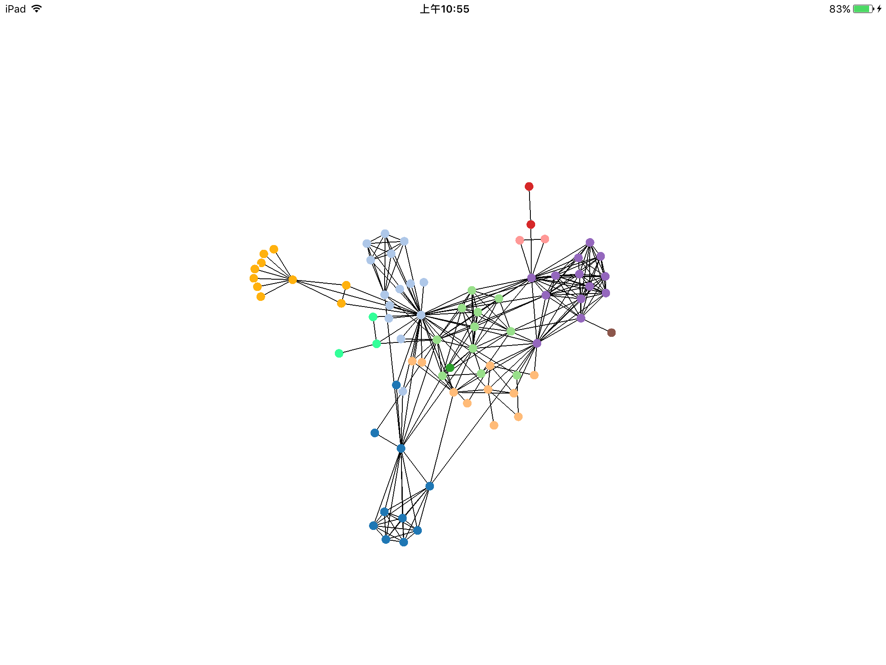

## Forces

提供创建力导图的API

### ForceSimulation

具体见`DFIForceSimulation.h`头文件。**DFIForceSimulation**类用来描述了一个场景：多个节点在多种类型的力相互作用下的运动情况。该场景下会包含多个节点；也会包含多种力，比如：弹簧力，万有引力，向心力等等

#### API

[#]() `@property (nonatomic, strong) NSMutableArray *nodes;`

*nodes* : 表示一个simulation中包含的节点

[#]() `- (instancetype)initWithNodes:(NSMutableArray *)nodes;`

函数说明：

使用多个node，初始化一个simulation

参数说明：

*nodes* : simulation中包含的节点，可以从一个文件中读取。每个node是一个**DFIForceNode**对象，详见[DFIForceNode]()

[#]() `- (void)addForce:(DFIForceBaseForce *)force;`

函数说明：

向simulation中添加一种力。force是**DFIForceBaseForce**类的一个特定的继承类的对象

参数说明：

*force* ：是**DFIForceBaseForce**类的一个特定的继承类的对象

[#]() `- (void)forceStart;`

函数说明：

已经向simulation里面添加了nodes和forces后，就可以运行该函数，开始模拟节点的运动情况了

[#]() `- (void)restart;`

函数说明：

顾名思义，重新开始模拟运动情况

### ForceNode

具体见`DFIForceNode.h`头文件，**DFIForceNode**类用来表述节点的信息

#### API

[#]() `@property (nonatomic, strong) NSString *id;`

*id* : 节点的identifier

[#]() `@property(nonatomic, assign) int index;`

*index* : 节点的序列号，表示第几号节点

[#]() `@property(nonatomic, assign) float x;`

*x* : 节点当前的x坐标

[#]() `@property(nonatomic, assign) float y;`

*y* : 节点当前的y坐标

[#]() `@property(nonatomic, assign) float vx;`

*vx* : 节点当前的x方向的速度

[#]() `@property(nonatomic, assign) float vy;`

*vy* : 节点当前的y方向的速度

[#]() `@property(nonatomic, assign) float fx;`

*fx* : 默认为0。当不为0时，表示节点受到外力作用，fx表示此时x方向的速度

[#]() `@property(nonatomic, assign) float fy;`

*fy* : 默认为0。当不为0时，表示节点受到外力作用，fy表示此时y方向的速度

[#]() `- (instancetype)initWithId:(NSString *)id andGroup:(int)group;`

函数说明： 使用id来新建一个节点

### BaseForce

具体见`DFIForceBaseForce.h`头文件，**DFIForceBaseForce**是各种force的基类

#### API

[#]() `- (instancetype)initWithNodes:(NSMutableArray *)nodes;`

函数说明：使用nodes新建一个force。nodes表示受该力影响的节点

[#]() `- (void)force:(float)alpha;`

函数说明：

模拟各个节点在该force下的运动情况，及时更新node的坐标以及速度

###CenterForce

具体见`DFIForceCenter.h`头文件。**DFIForceCenter**类表示向心力

#### API

[#]() `@property(nonatomic, assign) float x;`

*x* : 向心力的心的x坐标

[#]() `@property(nonatomic, assign) float y;`

*y* : 向心力的心的y坐标

[#]() `- (void)centerInitializeWithX:(float)x andY:(float)y;`

函数说明：使用x，y坐标来指定该向心力的中心

### LinkForce

具体见`DFIForceLink.h`头文件。**DFIForceLink**类表示弹簧作用力，两个节点间的作用力，与其他节点无关

#### API

[#]() `@property (nonatomic, strong) NSMutableArray *links;`

*links* : 表示所有的弹簧，具体类型为**DFIForceLinkElement**。详见[DFIForceLinkElement]()

[#]() `@property (nonatomic, assign) int iterations;`

*iterations*: 弹簧系数，不懂的话回去看物理书

[#]() `- (void)linksInitialize:(NSMutableArray *)links;`

函数说明：使用links来指定所有的弹簧作用力

### ManybodyForce

具体见`DFIForceManybody.h`头文件，**DFIForceManybody**表示万有引力

#### API

[#]() `@property(nonatomic, assign) float distanceMin;`

*distanceMin* : 最短距离，小于该距离的该力失去作用

[#]() `@property(nonatomic, assign) float distanceMax;`

*distanceMax* : 最长距离，大于该距离的该力失去作用

[#]() `@property(nonatomic, assign) float theta;`

*theta* : 引力系数

