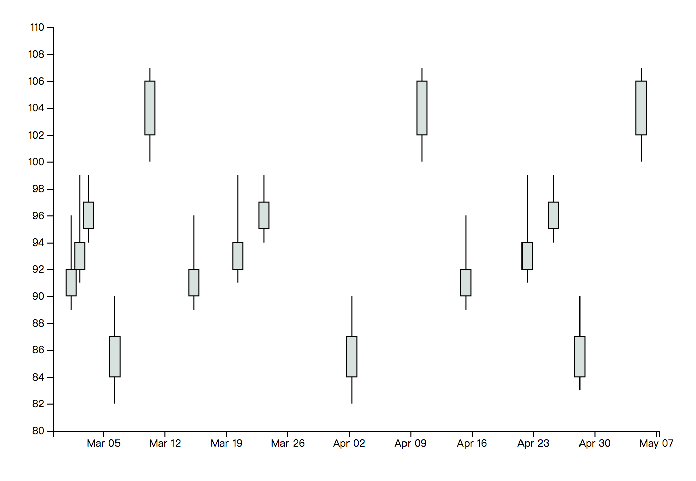
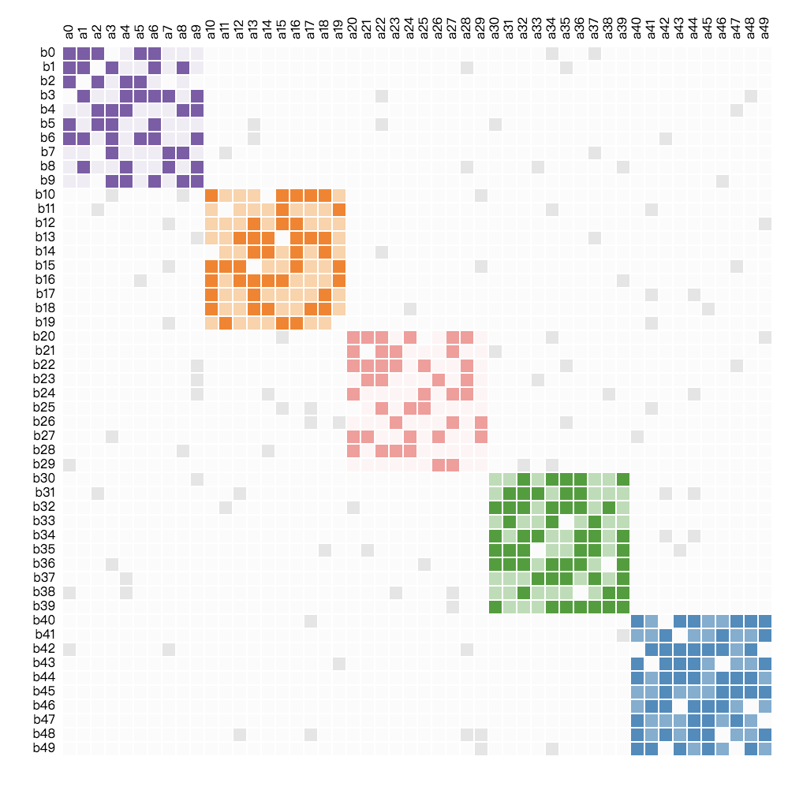
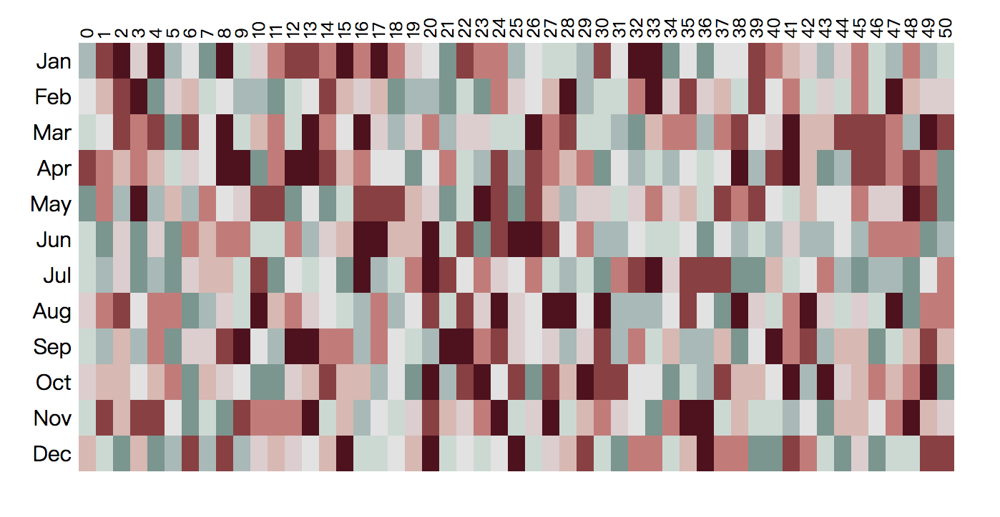
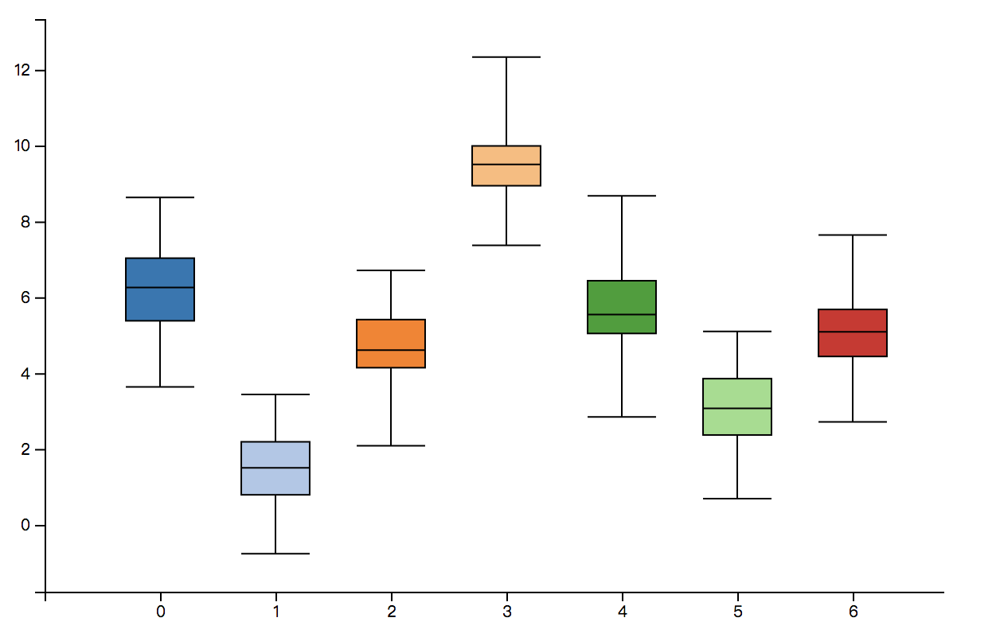

# Plot.js

一个用于数据可视化的js库。

## API Reference

[#]() Plot.**init**(elem, bgColor) [<>]()

该方法是库的初始化方法，用于生成一个canvas画布并返回执行上下文。

参数说明：

1. elem: canvas元素
2. bgColor: 画布的背景色

示例代码：

```javascript
Plot.init(document.getElementById('canvasId'), 0xffffff);
```

[#]() Plot.**begin**() [<>]()

该方法用于声明在canvas画布上开始绘制图形。

[#]() Plot.**circle**(x, y, r, stroke, fill) [<>]()

在画布上画出一个圆形。

参数说明：

1. x：圆心的x坐标
2. y：圆心的y坐标
3. r：圆形的半径
4. stroke：圆形的外边样式
5. fill：圆形的填充样式

示例代码：

```javascript
Plot.circle(10, 10, 5, {
  lineWidth: 5,
  color: 0xff0000,
  opacity: 1
}, {
  color: 0x00ff00,
  opacity: 0.8
})
```

[#]() Plot.**rect**(x, y, width, height, stroke, fill) [<>]()

在画布上画出一个矩形。

参数说明：

1. x：矩形左上角的x坐标
2. y：矩形左上角的y坐标
3. width：矩形的宽度
4. height：矩形的高度
5. stroke：矩形的外框样式
6. fill：矩形的填充样式

示例代码：

```javascript
Plot.rect(10, 10, 30, 30, {
  lineWidth: 5,
  color: 0xff0000,
  opacity: 1
}, {
  color: 0x00ff00,
  opacity: 0.8
})
```

[#]() Plot.**ellipse**(x, y, rw, rh, stroke, fill) [<>]()

在画布上画出一个椭圆。

参数说明：

1. x：椭圆中心的x坐标
2. y：椭圆中心的y坐标
3. rw：椭圆x轴方向的半径
4. rh：椭圆y轴方向的半径
5. stoke：椭圆外边框样式
6. fill：椭圆的填充样式

示例代码：

```javascript
Plot.ellipse(10, 10, 20, 20, {
  lineWidth: 5,
  color: 0xff0000,
  opacity: 1
}, {
  color: 0x00ff00,
  opacity: 0.8
})
```

[#]() Plot.**line**(sx, sy, ex, ey, stroke) [<>]()

在画布上画出一条直线。

参数说明：

1. sx：直线的起始x坐标
2. sy：直线的起始y坐标
3. ex：直线的结束x坐标
4. ey：直线的结束y坐标
5. stoke：直线的样式

示例代码：

```javascript
Plot.line(10, 10, 20, 20, {
  lineWidth: 5,
  color: 0xff0000,
  opacity: 1
})
```

[#]() Plot.**arc**(cx, cy, r, stroke, startAngle, endAngle, clockwise) [<>]()

在画布上画出一条圆弧。

参数说明：

1. cx：圆弧的圆心x坐标
2. cy：圆弧的圆心y坐标
3. r：圆弧的半径
4. stroke: 圆弧的样式
5. startAngle: 圆弧的起始角度
6. endAngle：圆弧的结束角度
7. closewise：圆弧绘制时的时针方向

示例代码：

```javascript
Plot.arc(10, 10, 20, {
  lineWidth: 5,
  color: 0xff0000,
  opacity: 1
}, 0, Math.PI, false)
```

[#]() Plot.**end**() [<>]()

该方法用于声明在canvas画布上完成图形的绘制，并对图形进行渲染。

### 模板图形

[#]() Plot.**candleStick**(data, configs) [<>]()

绘制蜡烛图(K线图)。



参数说明：

1. data：提供的绘图数据
2. configs：图表的配置信息

示例代码：

```javascript
Plot.candleStick([{
        date: "2017-03-01",
        value: [89, 90, 92, 96]
      },
      {
        date: "2017-03-02",
        value: [91, 92, 94, 99]
      },
      {
        date: "2017-03-03",
        value: [94, 95, 97, 99]
      },
      {
        date: "2017-03-06",
        value: [82, 84, 87, 90]
      },
      {
        date: "2017-03-10",
        value: [100, 102, 106, 107]
      },
      {
        date: "2017-03-15",
        value: [89, 90, 92, 96]
      },
      {
        date: "2017-03-20",
        value: [91, 92, 94, 99]
      },
      {
        date: "2017-03-23",
        value: [94, 95, 97, 99]
      },
      {
        date: "2017-04-02",
        value: [82, 84, 87, 90]
      },
      {
        date: "2017-04-10",
        value: [100, 102, 106, 107]
      },
      {
        date: "2017-04-15",
        value: [89, 90, 92, 96]
      },
      {
        date: "2017-04-22",
        value: [91, 92, 94, 99]
      },
      {
        date: "2017-04-25",
        value: [94, 95, 97, 99]
      },
      {
        date: "2017-04-28",
        value: [83, 84, 87, 90]
      },
      {
        date: "2017-05-05",
        value: [100, 102, 106, 107]
      }], {
        blockWidth: 10,
  		blockColor: 0x542cf3
      })
```

[#]() Plot.**heatmap**(type, data, configs) [<>]()

提供对几种heatmap类型图表的绘制。





参数说明：

1. type：heatmap类型，目前提供**type1**、**type2**两种
2. data：heatmap图表的数据
3. configs：对图表的配置信息

示例代码：

```javascript
Plot.heatmap('type1', [{
  xLabel: 'Jan',
  yLabel: 0,
  color: 0x23ffee,
  hoverInfo: {
    date: 'Jan 0'
    rate: '3%'
  }
}, {
  xLabel: 'Jan',
  yLabel: 1,
  color: 0x23ffee,
  hoverInfo: {
    date: 'Jan 1'
    rate: '7%'
  }
}, {
  xLabel: 'Jan',
  yLabel: 2,
  color: 0x23ffee,
  hoverInfo: {
    date: 'Jan 2'
    rate: '6%'
  }
}], {
  rows: 12,
  columns: 50,
  gap: 1
})
```

[#]() Plot.**boxplot**(data, configs) [<>]()

提供对盒形图(boxplot)的绘制。



参数说明：

1. data：boxplot的图表数据
2. configs：boxplot的配置信息

实例代码：

```javascript
Plot.boxplot([{
  color: 0xff0000,
  data: [3.5, 5.5, 6.5, 7, 8.5],
  xLa
}, {
  color: 0x00ff00,
  data: [4, 7, 8, 8.5, 10]
}, {
  color: 0x0000ff,
  data: [3, 5, 6.5, 7, 9.5]
}], {
  blockWidth: 15
})
```

## iOS API

- [Chords](./API/Chords.md)
- [Colors](./API/Colors.md)
- [Delimiter-Separated Values](./dsv.md)
- [Forces](./Forces.md)
- [Hierarchies](./Hierarchies.md)
- [Paths](./Paths.md)
- [Shapes](./Shapes.md)